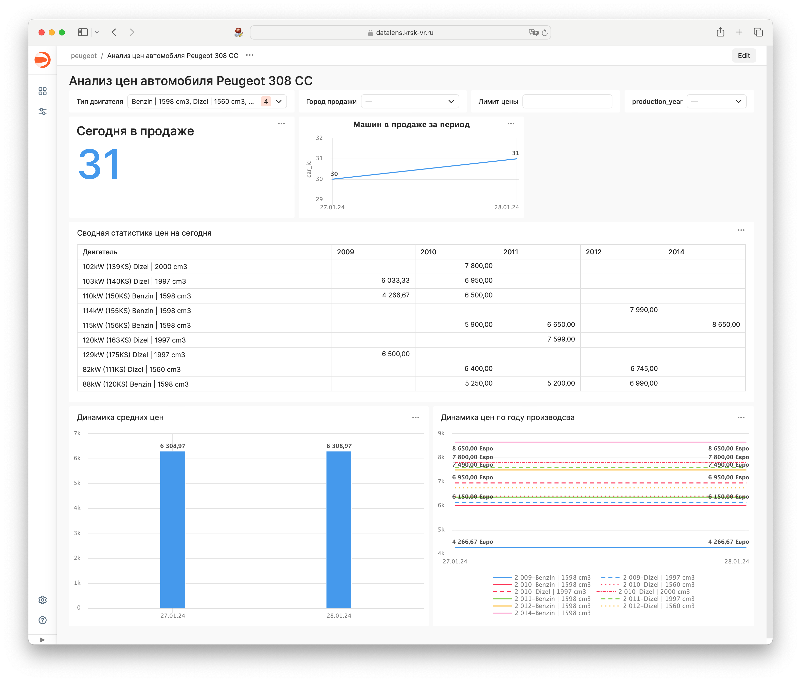

# Car Price Monitoring and Data Collection Script

## Overview
This script is designed for in-depth monitoring and analysis of specific car models' prices in the market. It efficiently tracks price changes, helping to gauge market trends and liquidity for selected car models. The script automates the collection of detailed car data, which can later be analyzed with various BI tools.

## Features

- **Dynamic Price Monitoring**: Tracks and records the prices of specified car models, providing insights into market trends and pricing dynamics.
- **Advanced Data Collection**: Automatically scrapes and stores extensive details about each car, including type, engine power, mileage, and more.
- **Geolocation Data Integration**: Utilizes the Yandex Geocoder API to convert city names into precise geocoordinates, enriching the dataset with valuable location information.
- **Efficient Data Management**: Saves all collected data into a PostgreSQL database, ensuring easy access and analysis through SQL queries or BI tools.
- **Pagination Handling**: Navigates through multiple pages of web listings to ensure comprehensive data collection.
- **Database Optimization**: Avoids redundant API calls by caching geolocation data, enhancing efficiency and reducing operational costs.

## Technical Implementation

- **YandexGeocoder Class**: Handles the conversion of addresses to geocoordinates using the Yandex Geocoder API.
- **CarParser Class**:
  - Initializes with the target URL, query parameters, database configuration, and API key.
  - Scrapes data from the web and structures it into a DataFrame.
  - Checks for existing geolocation data in the database before making new API requests.
  - Parses multiple pages of listings and aggregates the results.
  - Provides a method to save the final dataset into a PostgreSQL database.

## Usage

1. Initialize the `CarParser` class with the appropriate configurations.
2. Call the `parse_all_pages` method to begin data collection.
3. The collected data, stored in a DataFrame, can then be saved to a database using the `save_to_database` method.

## Database Schema

- **Car Data Table**: Stores car information including ID, request timestamp, cabin type, engine type, mileage, engine power, price, cleaned price, city, and coordinates.
- **Coordinates Table**: Caches geolocation data to minimize redundant API requests.

## Screenshot

## Map

## Data Visualization

Explore and visualize the collected data on [DataLens](https://datalens.yandex/oj5daeja71l4c).
