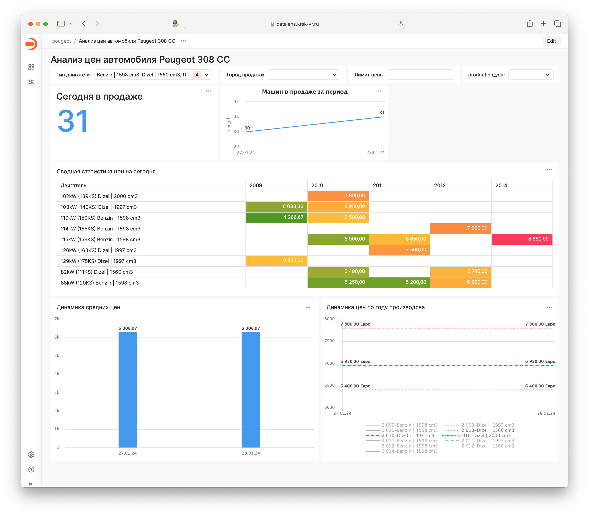

# Car Price Monitoring Script

## Description
This script is designed for monitoring the price of a specific car model of interest. The primary goal is to understand the price dynamics and market liquidity of the car. By collecting and saving data about the car, the script facilitates subsequent analysis using various Business Intelligence (BI) tools.

## Features
- Monitors car prices for specified models.
- Saves data for further analysis.
- Compatible with various BI tools for in-depth analysis.

## Usage
Run the script to start monitoring car prices. The data collected will be stored and can be used for future analysis.

## Screenshot

